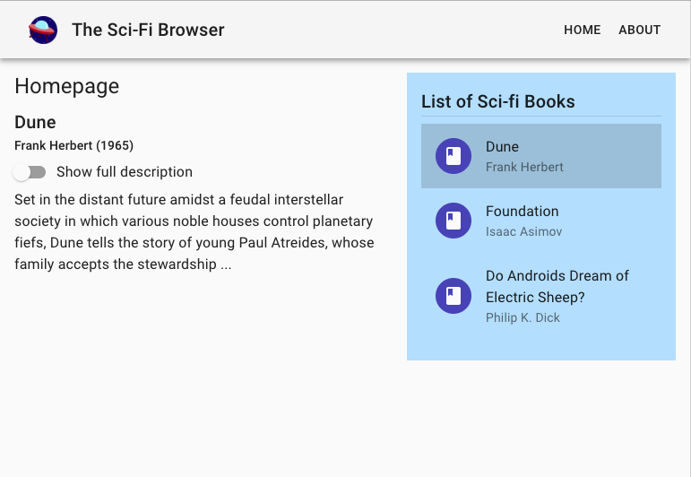

#  ReactJS: A Quick Tutorial to Learn the Basics
#####  Mina Pêcheux - Summer 2019

## 0. Preliminary Notes

- This tutorial will be easier to follow if you have a basic knowledge of HTML, CSS and JavaScript. However, if you feel like a small reminder on things like JS imports, JS data structures and deconstruction or CSS states, don't hesitate to peek at the Bonus section.

- For convenience, a template project is already prepared on Github with some basic files. Just clone the repository and go into the folder.

  An important idea of ReactJS is that it makes use of the JSX (JavaScript eXtension) language which allows to gather the HTML, CSS and JavaScript all in the same place, inside "components". Thus we switch from a technology-driven to a component-driven philosophy. Because JSX is not directly usable by browsers, a React project needs some configuration files to process the source files and "bundle" (the word is *very* loosely equivalent to "compile" here) your JSX files into readable HTML/CSS/JavaScript web pages for the browser.
  
  *Note: this is done through the `webpack.js` file... to learn more about this, take a peek at the Bonus section.*

  Throughout this whole tutorial, we are going to work on our app in `dev` mode. This will allow us to have an automatic refresh of the page and to avoid having to make a server to serve the bundled files. But, first, we need to install the necessary packages thanks to the given `package.json` file (*note: to learn more about this, refer to the Bonus section!*). To do so, make sure you are at the root of the `react` folder, and run this command:
  
    ```
    npm install
    ```
  
  This might take up to a minute because the template repository comes with all the packages needed for the tutorial already prepared, so `npm` will have to install a few things.

  When the packages are finished installing, to run the app in `dev` mode, just use this command:
  
    ```
    npm run start:dev
    ```
  
  ReactJS will inform you that the app is now running on `localhost:8080`. Open up a browser and go to this address to see what our app looks like for now... that is a blank screen!
  
  *Note: you don't actually need to bother about all these details; just trust that the recommended instructions will work, and report to the Bonus section if you want to learn more!*

## 1. Global Project Architecture

- This is just one example of standard project organisation. You can choose many different architectures and tools like `create react-app` (see the [official Github](https://github.com/facebook/create-react-app)), for example, provide you with another project organisation.
- The overview of the global project architecture proposed here is the following:
  - at the root: package management, parsing/compiling...
  - `assets/`: static resource (e.g.: images)
  - `dist/`: auto-generated by ReactJS upon compilation (= actual bundled web pages)
  - `src/` *- that's where the magic happens!*: definition of containers, components, stores, util functions... This folder is further subdivided into `components/`, `containers/` and `stores/`. It also contains two files that tell ReactJS where to pick what it needs to render: the `index.html` and the `index.js`. *We will not study them in detail here, but you can see the Bonus section to learn more.*
  
  

## 2. Building a Little App, Step by Step...

- In this tutorial, we are going to create a very simple app called "The Sci-Fi Browser". This app will have a menu bar at the top and two pages: a homepage and an about page. In the former, there will be a sidebar that lists a few nice sci-fi books; when we click on a title, more info will be displayed on the left. In the latter, we will simply have some text to explain more about this app. The overview UI mockup is the following (suppose we are currently on the homepage):

  

  We see that our interface is composed of:
  - a global `Root` that contains everything in our page:
  - then in this `Root`, we have a basic `SimpleAppBar` component on top and another container at the bottom, the `Homepage` or the `AboutPage` depending on which page we are currently on
  - and inside all these we have smaller components (e.g.: the `Sidebar`) or simple elements like text, buttons and so on
  - moreover, on the homepage, the item that you selected in the list on the right determines what content should be shown on the left: there is *interaction* between various components

- As discussed earlier, the nice thing with ReactJS is that we can simply "map" this UI mockup into a website, container by container and component by component, gradually reproducing this interface.

  Here is a screenshot of the app:
  
  

### 2.1. A Very Basic Start

- To begin with, we are going to create the three containers (the `Root`, the `Homepage` and the `AboutPage`) and a basic `AppBar` component.

- The first thing we need to create is our `Root`. This container encompasses our whole app. Let's create a new file `Root.jsx`, place it into our `src/containers/` folder and paste the following code in it:

  ```js
  import React from 'react';

  import Homepage from './Homepage';
  import AboutPage from './AboutPage';
  import SimpleAppBar from '../components/AppBar';

  class Root extends React.Component {

    render() {
      return (
        <div>
          <SimpleAppBar />
          <Homepage />
          <AboutPage />
        </div>
      );
    }
    
  };

  export default Root;
  ```

  Let's take some time to analyse what is going on here; there are already quite a few interesting React basics to notice here. The file can be cut down into 3 parts: the imports, the class definition, and the export.

  1. Firstly, we import the dependencies or other containers and components this object will rely on: the actual `React` library, of course, but also our own `Homepage`, `AboutPage` and `SimpleAppBar` objects - that we will create and fill in a second.

  2. Secondly, we create our `Root` object itself. Notice that it inherits the `React.Component` class, because it is a React object, which allows it to perform and handle all the cool stuff we saw earlier: state and properties, conditional rendering... and in particular automatically tells React that whatever is returned by its `render()` method should be rendered on the webpage.

  3. Thirdly, we "export" our component. What this means is that, now, any other JS(X) file in our project can import this component and use it directly (this is how we could import the `SimpleAppBar`, `Homepage` and `AboutPage` objects that we will define in other files). Once again, it is crucial to have a good encapsulation of our objects so that our code isn't too long!

  *Note: although it might not be obvious why we need to export the `Root` itself, since it contains and therefore is not used by our other objects, the `index.js` file mentioned before actually uses it to tell ReactJS that the `Root` is the main block it should render.*

  *Note 2: if you want to learn more about the various exports, and why we use the keyword `default` here, refer to the Bonus section of this tutorial!*

- Now, creating the `Homepage`, the `AboutPage` and the `SimpleAppBar` will be quite straightforward: for each of them, we simply need to import the `React` package, create a new object that extends the base `React.Component` class and export it. Let's create two `Homepage.jsx` and `AboutPage.jsx` files in the `src/containers/` folder and a `SimpleAppBar.jsx` file in the `src/components/` folder with the following codes:

  ```js
  import React from 'react';

  class Homepage extends React.Component {

    render() {
      return (
        <div>
          <h4>Homepage</h4>
          <span>Hello world! This is my first ReactJS app :)</span>
        </div>
      );
    }
  }

  export default Homepage;
  ```

  ```js
  import React from 'react';

  class AboutPage extends React.Component {

    render() {
      return (
        <div>
          <h4>About</h4>
          <span>The Sci-Fi Browser is a small app that lists a few nice sci-fi books and gives some additional info on them. Select an item in the list on the right to change the content on the left.</span>
        </div>
      );
    }
  }

  export default AboutPage;
  ```

  ```js
  import React from 'react';

  class SimpleAppBar extends React.Component {

    render() {
      return (
        <div>
          <div>
            
          </div>
          <div>
            <div>Home</div>
            <div>About</div>
          </div>
        </div>
      );
    }

  }

  export default SimpleAppBar;
  ```

- Now, if you refresh your page, you should see... this.

  

  Not great, right? There are clearly two main problems with this draft:
  
  1. It's ugly and the elements are not in the right spot!
  2. Both the contents of the `Homepage` and of the `AboutPage` are shown at the same time!
  
  Don't worry, we are going to remedy that in a second: in the next section, we will take care of the ugliness, then in the one after that we'll add some actions on our menu buttons to handle the homepage/about page switch.

### 2.2. Let's Style This Up!

- Alright, everything is there, but it kind of hurts the eye. Before adding anything more to our app, we are going to do some styling; first, with direct class definitions and "CSS-like" programming, then by importing some already well-prepared components from a nice React UI framework called [MaterialUI](https://material-ui.com/).

#### 2.2.i. Basic Styling

- An easy way to add CSS styling is to add a stylesheet and then add the corresponding selectors to our HTML elements. This is familiar to people who have already done some web-programming and follows the usual tech-driven approach: the HTML parts of your React objects define its structure and you use a separate file to set the styling.

- However, because JSX incorporates all 3 web technologies (HTML, CSS and JavaScript), we can add our CSS directly in our files by passing in CSS properties to our elements as JavaScript objects:

  ```js
  import React from 'react';

  class Homepage extends React.Component {

    render() {
      const { classes } = this.props;

      return (
        <div style={{ marginTop: '8px', padding: '8px', fontFamily: 'Roboto' }}>
          <h4 style={{ fontSize: '1.5em' }}>Homepage</h4>
          <span>Hello world! This is my first ReactJS app :)</span>
        </div>
      );
    }
  }

  export default Homepage;
  ```

  *Note: of course, we could edit our `AboutPage` container the same way.*

- But you can already see that this will be cumbersome: adding long objects on each of our elements this way is not the best method.

#### 2.2.ii. Getting Started with MaterialUI - Leveling Up to Class Injection

- Before we actually use components from the MaterialUI framework, we are going to take a look at one basic feature it offers: class injection in our JSX objects. The idea is that, instead of directly adding a "style" object in our HTML elements, we are going to prepare an object with all of our classes beforehand and then pass it to the object itself.

  First things first: we need to prepare our `Root` to create the whole MaterialUI (or "MUI") context and pass it to the rest of the app. This is done with this code:
  
  ```js
  import React from 'react';
  import { withStyles } from '@material-ui/core/styles';
  import CssBaseline from '@material-ui/core/CssBaseline';
  import MuiThemeProvider from '@material-ui/core/styles/MuiThemeProvider';

  import { indigo, red } from '@material-ui/core/colors';
  import { createMuiTheme } from '@material-ui/core/styles';

  import Homepage from './Homepage';
  import AboutPage from './AboutPage';
  import AppBar from '../components/AppBar';

  const theme = createMuiTheme({
    transitions: {
      create: () => 'none'
    },
    palette: {
      primary: indigo,
      secondary: { main: '#bbdefb' },
      error: red,
    },
    typography: {
      useNextVariants: true,
    }
  });

  class Root extends React.Component {

    render() {
      return (
        <MuiThemeProvider theme={theme}>
          <CssBaseline />
          <div>
            <AppBar />
            <Homepage />
            <AboutPage />
          </div>
        </MuiThemeProvider>
      );
    }
  };

  export default Root;
  ```
  
  We added a few imports and changed the `render()` function to use the newly created `theme` globally in he website. One advantage of this technique is that, as you can see, we will now be able to access our MaterialUI's `theme` which holds a whole palette of predefined margin spacing, colors and much more to help us have a consistent UI styling in the app!
  
  But how do we actually use the `theme` in our objects?

  Well, let's modify our `Homepage` - subtle changes, but that will improve the layout overall and show us the basics. We will update it in 5 ways: we'll add an import from the `@material-ui` package, define styles, get them back in the `render()` method of the object, use them in the HTML element and inject them during export to be sure our object knows about them.

  ```js
  import React from 'react';
  import { withStyles } from '@material-ui/core/styles';

  const styles = (theme) => ({
      container: {
        marginTop: theme.spacing(1),
        padding: theme.spacing(2),
        fontFamily: 'Roboto'
      },
      title: {
        fontSize: '1.5em'
      }
  });

  class Homepage extends React.Component {

    render() {
      const { classes } = this.props;

      return (
        <div className={classes.container}>
          <h4 className={classes.title}>Homepage</h4>
          <span>Hello world! This is my first ReactJS app :)</span>
        </div>
      );
    }
    
  }

  export default withStyles(styles)(Homepage);
  ```
  
  *Note: like before, you can update the `AboutPage` in a similar way!*

  We immediately spot several improvements of this method compared to simple styling:
  - we gather all of our CSS just in one spot, easily readable, but still in the same file as the rest of our JSX object
  - this CSS styling is passed to this object only so we can have multiple styles with the same name that are slightly different between two JSX objects, if need be
  - we access our global MaterialUI's `theme` simply
  
  *Note: when creating HTML inside a JSX object, you need to use the keyword "className" instead of "class" to assign a class to an element.*

- We can also add some styling to the `SimpleAppBar` component to get something a bit more 21st century:

  ```js
  import React from 'react';
  import { withStyles } from '@material-ui/core/styles';

  const styles = (theme) => ({
      appBar: {
        display: 'flex',
        justifyContent: 'space-between',
        alignItems: 'stretch',
        background: '#eeeeee',
        fontFamily: 'Roboto',
        boxShadow: '2px 2px 2px #888888'
      },
      inline: {
        display: 'flex'
      },
      icon: {
        marginRight: theme.spacing(2),
        paddingLeft: theme.spacing(1),
        paddingTop: theme.spacing(1),
        paddingBottom: theme.spacing(1)
      },
      appButton: {
        paddingLeft: theme.spacing(1),
        paddingRight: theme.spacing(1),
        paddingTop: theme.spacing(2),
        cursor: 'pointer',
        '&:hover': {
          background: '#cccccc'
        }
      }
  });

  class SimpleAppBar extends React.Component {

    render() {
      const { classes } = this.props;

      return (
        <div className={classes.appBar}>
          <div className={classes.inline} style={{ alignItems: 'center' }}>
            <div className={classes.icon}>
              
            </div>
            <span>This is the App Bar.</span>
          </div>
          <div className={classes.inline}>
            <div className={classes.appButton}>Home</div>
            <div className={classes.appButton}>About</div>
          </div>
        </div>
      );
    }

  }

  export default withStyles(styles)(SimpleAppBar);
  ```
  
  There are some additional tricks in, namely some mix of classes and direct element styling, and a bit of CSS state parametrisation with the `&:hover` property (which allows us to update the button's background color when the mouse enters it).

- That's a bit better! Now, we have some nice font, colors, spacing and hover effects when we move the mouse over our menu buttons.

#### 2.2.ii. Using MaterialUI's Components

- However, it is a bit annoying to have to define all these classes. In particular, if we happen to have other buttons in some other object, then we will have to define the exact same class... wouldn't it be better if we could simply import a `Button`? This is the whole point of UI frameworks like MaterialUI.

  *Note: this is not to say that styling through class injection is not in MaterialUI's philosophy, but the core idea of the framework is to use components, and only then to tweak them further if you want a custom styling...*

- If you go to their website, you will find a list of all the available components and their precise API so you know what properties you can pass them to customise them to suit your needs. Among other things, the framework offers a  `Typography` component to better handle our fonts with title variations. As always, let's start with our `Homepage.jsx` (or `AboutPage.jsx`) file, and update its content to the following:

  ```js
  import React from 'react';
  import { Typography } from '@material-ui/core';
  import { withStyles } from '@material-ui/core/styles';

  const styles = (theme) => ({
    container: {
      padding: theme.spacing(2)
    }
  });

  class Homepage extends React.Component {

    render() {
      const { classes } = this.props;

      return (
        <div className={classes.container}>
          <Typography variant='h5'>Homepage</Typography>
          <Typography>Hello world! This is my first ReactJS app :)</Typography>
        </div>
      );
    }
    
  }

  export default withStyles(styles)(Homepage);
  ```

  We are now combining some custom styling with the use of a handy component taken directly from MaterialUI framework: the `Typography` component. We see that this component can serve for simple paragraphs as well as titles thanks to its `variant` property.

- Thanks to other components in the framework, like the `AppBar` and the `Button` ones, we can also pump up our `SimpleAppBar` component this way:

  ```js
  import React from 'react';
  import { withStyles } from '@material-ui/core/styles';
  import {
    AppBar,
    Button,
    Toolbar,
    Typography
  } from '@material-ui/core';

  const styles = (theme) => ({
    root: {
      flexGrow: 1,
    },
    icon: {
      marginRight: theme.spacing(2),
      paddingLeft: theme.spacing(1),
      paddingTop: theme.spacing(1),
      paddingBottom: theme.spacing(1)
    },
    menuButton: {
      marginRight: theme.spacing(2),
    },
    title: {
      flexGrow: 1,
    }
  });

  class SimpleAppBar extends React.Component {

    render() {
      const { classes } = this.props;
      
      return (
        <div className={classes.root}>
          <AppBar position='static' color='default'>
            <Toolbar>
              
              <Typography variant='h6' className={classes.title}>
                The Sci-Fi Browser
              </Typography>
              <Button>Home</Button>
              <Button>About</Button>
            </Toolbar>
          </AppBar>
        </div>
      );
    }

  }

  export default withStyles(styles)(SimpleAppBar);
  ```
  
  Now, this looks like a nice basic app!
  
  


### 2.3. Linking Up the Menu with a `Router`

- But, so far, our app is quite static: these pretty buttons in the menu are not doing anything. And sadly, we packed everything in there and are seeing both the content of the homepage and the about page below each other. What we want is to be able to switch between our homepage and our about page by clicking on the menu buttons.

- To add this feature, we are going to incorporate a `Router` in our app. This component is hard to program in itself but, hopefully, a package already provides it; thus, let's install the required packages with this command:

  ```
  npm install react-router-dom
  ```
  
- After the installation is complete, we can import lots of useful components in our website to add the whole navigation system easily.

  First, we need to update the `Root.jsx` file to add the `Router`. Like the MaterialUI's theme provider, this component will encompass the entire app, so that we can do some routing wherever we want in the website. So, with a few new imports at the top of the file from the `react-router-dom` package and the implementation of a `Router` and matching `Route` elements inside, here is how our `Root.jsx` file now looks like:
  
  ```js
  import React from 'react';
  import {
    Route,
    BrowserRouter as Router
  } from 'react-router-dom';

  // (... same as before)
  
  // we add some styling too!
  const styles = (theme) => ({
    root: {
      display: 'flex',
      flexDirection: 'column',
      height: '100%'
    },
    container: {
      padding: theme.spacing(2),
      flexGrow: 1
    },
  });

  class Root extends React.Component {

    render() {
      const { classes } = this.props;
      
      return (
        <MuiThemeProvider theme={theme}>
          <CssBaseline />
          <Router>
            <div className={classes.root}>
              <AppBar />
              <div className={classes.container}>
                <Route exact path='/' component={Homepage} />
                <Route exact path='/about' component={AboutPage} />
              </div>
            </div>
          </Router>
        </MuiThemeProvider>
      );
    }
    
  };

  export default withStyles(styles)(Root);
  ```
  
  *Note: because both the homepage and the about page live in a main container that requires some styling, this version of the `Root.jsx` also presents the "container" class styling moved up a level, so that it can be removed from the `Homepage.jsx` and `AboutPage.jsx` files.*
  
  It is important to remember what paths we defined here, because those are the links we will need to access when clicking on our menu buttons. The homepage is at the root of the website (the `/` address) and the about page is at the relative `/about` path.
  
- Our `Router` is all set up, time to use it in our `SimpleAppBar` component! To do so, we will need to use `NavLink`, another component provided by the `react-router-dom`. This object is meant to tell ReactJS to switch to another `Route` whenever it is clicked.

  ```js
  // (... same as before)

  import { NavLink } from 'react-router-dom';

  class SimpleAppBar extends React.Component {

    render() {
      const { classes } = this.props;
      
      return (
        <div className={classes.root}>
          <AppBar position='static' color='default'>
            <Toolbar>
              
              <Typography variant='h6' className={classes.title}>
                The Sci-Fi Browser
              </Typography>
              <NavLink className={classes.menuButton} exact to='/'>
                <Button>Home</Button>
              </NavLink>
              <NavLink className={classes.menuButton} exact to='/about'>
                <Button>About</Button>
              </NavLink>
            </Toolbar>
          </AppBar>
        </div>
      );
    }

  }

  export default withStyles(styles)(SimpleAppBar);
  ```
  
  Remember the paths we discussed before? They appear once again in our `NavLink` instances here: in the `to` property, we specify the path of the `Route` that we want to switch to whenever we click the element.
  
- Finally, we can refresh our page and we notice that the content of the about page has disappeared! We only have the homepage here, which is great. And, even better, if we click on the menu buttons in the app bar, we can switch from one page to the other!

- It is worth mentioning that, when we use `NavLink`, the URL changes in the top bar of the browser, but it is not an actual link. If you try to go to the `localhost:8080/about` page directly (i.e.: not by clicking on the button in our interface), you will get an error. That is because, in truth, the `Router` only updates the render but doesn't truly get to another page; the only URL our app knows about is the root itself (`localhost:8080`).

### 2.4. Working on the Homepage

- We have set up lots of nice mechanisms in our little website, but the homepage is still pretty dumb, for now. In this section, we are going to fill it up.

- Remember that are we going to create the aforementioned sidebar with a list of sci-fi books and a holder for the content on the left that will depend on which item is selected in the list. This means we need to introduce interactions between multiple components - but we saw earlier that components are sort of "isolated" and only know about their own properties and state. To solve this issue of using global data easily, we will implement yet another important thing in ReactJS apps: a store.

  But to keep things easy for now, we will just start with the creation of components themselves, using some dummy data.
  
  *Note: this is usually a nice way to proceed: first, prepare your containers or components with some local dummy data, and then actually link the new thing to the rest of your data flow. This allows you to better understand what goes where and better define how you should format the input data.*
  
  *This philosophy even gave birth to the "[storybooks](https://storybook.js.org/)": thanks to this React package, you can prepare your components with their inputs, and then have a specific page, separated from the rest of your app, with just one React object at once which you feed some local data. This avoids the overhead of having your data propagated properly and handling the entire hierarchy of JSX containers or components at the same time.*

#### 2.4.i. Preparing our Components

- Because we have already seen how to create JSX objects quite in depth in the previous sections, let's not spend too much time on this first version: we will simply update the `Homepage.jsx` file and create a new `Sidebar.jsx` file in the `src/components/` folder.

  The `Homepage` container now contains this code:

  ```js
  import React from 'react';
  import { Typography } from '@material-ui/core';
  import { withStyles } from '@material-ui/core/styles';

  import Sidebar from '../components/Sidebar';

  const styles = (theme) => ({
    root: {
      display: 'flex'
    },
    content: {
      flexGrow: 1,
    }
  });

  class Homepage extends React.Component {

    render() {
      const { classes } = this.props;

      return (
        <div className={classes.root}>
          <div className={classes.content}>
            <Typography variant='h5'>Homepage</Typography>
            <Typography>Hello world! This is my first ReactJS app :)</Typography>
          </div>
          <Sidebar />
        </div>
      );
    }
    
  }

  export default withStyles(styles)(Homepage);
  ```
  
  The `Sidebar` makes use of a whole bunch of nice MaterialUI's components to create our list with small icons and all:
  
  ```js
  import React from 'react';
  import { withStyles } from '@material-ui/core/styles';

  import {
    Avatar,
    List,
    ListItem,
    ListItemText,
    ListItemAvatar,
    Typography
  } from '@material-ui/core';
  import BookIcon from '@material-ui/icons/Book';

  const styles = (theme) => ({
    root: {
      background: theme.palette.secondary.main,
      padding: theme.spacing(2),
      minWidth: 300,
      maxWidth: 300
    },
    avatarIcon: {
      backgroundColor: theme.palette.primary.main
    }
  });

  class Sidebar extends React.Component {

    render() {
      const { classes } = this.props;

      return (
        <div className={classes.root}>
          <Typography variant='h6'>List of Sci-fi Books</Typography>
          <List>
            <ListItem>
              <ListItemAvatar>
                <Avatar className={classes.avatarIcon}><BookIcon /></Avatar>
              </ListItemAvatar>
              <ListItemText primary='Dune' secondary='Frank Herbert' />
            </ListItem>
            <ListItem>
              <ListItemAvatar>
                <Avatar className={classes.avatarIcon}><BookIcon /></Avatar>
              </ListItemAvatar>
              <ListItemText primary='Foundation' secondary='Isaac Asimov' />
            </ListItem>
            <ListItem>
              <ListItemAvatar>
                <Avatar className={classes.avatarIcon}><BookIcon /></Avatar>
              </ListItemAvatar>
              <ListItemText primary='Do Androids Dream of Electric Sheep?' secondary='Philip K. Dick' />
            </ListItem>
          </List>
        </div>
      );
    }
    
  }

  export default withStyles(styles)(Sidebar);
  ```
  
- Quite quick and "okayish" work. However, if we want to add a new book to the list, we will need to create a whole new hierarchy of `ListItem`, `ListItemAvatar` and `ListItemText` by copy-pasting it by hand and correcting the title of the book and the author name. This is clearly not ideal, for 3 main reasons:

  1. Data is not super readable: it would be nice to have something like a list of book title/author name matches
  2. If we add loads of new books, this component is going to be very, very long...
  3. The list will not update automatically: if the list of sci-fi books is actually updated from some other sources, then it cannot refresh without us having to change the component manually
  
- Before improving our `Sidebar` component, let's also create new component in a `BookDisplayer.jsx` file (saved in the `src/components/` folder) that will be used in our `Homepage` container. This component contains the following code:

  ```js
  import React from 'react';
  import { Typography } from '@material-ui/core';

  class BookDisplayer extends React.Component {

    render() {
      const { classes } = this.props;
      
      const bookTitle = 'Dune';
      const bookAuthor = 'Frank Herbert';

      return (
        <div>
          <Typography variant='h6'>{bookTitle}</Typography>
          <Typography variant='subtitle2'>{bookAuthor}</Typography>
          <Typography>This is the book: {bookTitle}.</Typography>
        </div>
      );
    }
    
  }

  export default BookDisplayer;
  ```
  
  Nothing brand new, we just added some local data and displayed it with some MaterialUI util components. Of course, for now, there is no linkage between the list and the `BookDisplayer`; we just have two independent sources of data with no communication.
  
  We can now import it and use it in our `Homepage`:
  
  ```js
  import React from 'react';
  import { Typography } from '@material-ui/core';
  import { withStyles } from '@material-ui/core/styles';

  import BookDisplayer from '../components/BookDisplayer';
  import Sidebar from '../components/Sidebar';

  const styles = (theme) => ({
    root: {
      display: 'flex'
    },
    content: {
      flexGrow: 1,
    }
  });

  class Homepage extends React.Component {

    render() {
      const { classes } = this.props;

      return (
        <div className={classes.root}>
          <div className={classes.content}>
            <Typography variant='h5'>Homepage</Typography>
            <BookDisplayer />
          </div>
          <Sidebar />
        </div>
      );
    }
    
  }

  export default withStyles(styles)(Homepage);
  ```

#### 2.4.ii. Improving the Data Feed

- To address the 3 problems mentioned for our `Sidebar` component, we will take advantage of JSX and use JavaScript `map` functions inside our object's `render()` method to directly render the data into HTML elements.

- So, let's assume that we work on this piece of data:
  
  ```js
  const books = [
    { title: 'Dune', author: 'Frank Herbert' },
    { title: 'Foundation', author: 'Isaac Asimov' },
    { title: 'Do Androids Dream of Electric Sheep?', author: 'Philip K. Dick' }
  ];
  ```
  
  This holds the same information as our previous list, but it is way better organised! Plus, if we decide to add additional things later on (and spoiler: we will...) it will be easier to update this single object than to go through an entire block of HTML elements.
  
- Next thing we need to do is update our `Sidebar` component to use this JavaScript object cleverly (here, only the updated `render()` method is shown, the rest is identical):

  ```js
  render() {
    const { classes } = this.props;
    
    const books = [
      { title: 'Dune', author: 'Frank Herbert' },
      { title: 'Foundation', author: 'Isaac Asimov' },
      { title: 'Do Androids Dream of Electric Sheep?', author: 'Philip K. Dick' }
    ];

    return (
      <div className={classes.root}>
        <Typography variant='h6'>List of Sci-fi Books</Typography>
        <List>
          { books.map(({ title, author }, id) => {
            return (
              <ListItem key={id}>
                <ListItemAvatar>
                  <Avatar className={classes.avatarIcon}><BookIcon /></Avatar>
                </ListItemAvatar>
                <ListItemText primary={title} secondary={author} />
              </ListItem>
            );
          }) }
        </List>
      </div>
    );
  }
  ```
  
  Well! A lot is going on here and this is a weird construct at first. Let's go through it slowly to better understand how this works.
  
  1. Firstly, we put our local dummy data in the function, in a variable `books`, so that we can access it easily further on.
  2. Secondly, we changed the children elements of our `List` component: instead of having multiple `ListItem` that only differ by the title of the book and the author name, we have this strange piece of code surrounded by some `{` and `}` curly braces.
  
    These curly braces warn ReactJS that whatever is inside should actually be interpreted as JavaScript and not HTML. This is how JSX enables us to gather the two languages in the same place.
    
    Then, we use the [`map` function](https://developer.mozilla.org/fr/docs/Web/JavaScript/Reference/Objets_globaux/Array/map) that is available for JavaScript arrays. This method allows you to loop through each of the items in your list (extracting both the item and its id, as is shown here) and return something for each. Here, we are returning new small JSX objects at each iteration, in which we further use curly braces to access specific parts of our JavaScript current item variable (namely `title` and `author`).
    
    *Note: the code here also uses what is called "deconstruction" to directly create two variables from each key of the current object item. If you want more details on this, take a look at the Bonus section.*
    
  3. All the objects returned from the `map` loop will be put one after the other inside the `List` element, as we would write it manually.
  
#### 2.4.iii. Creating the Store and Propagating Data

- We want our store to be able to do three things:

  1. give us the complete list of sci-fi books in our (tiny-tiny) bookshop
  2. give us the reference of the book we are currently checking out
  3. update this reference if we click on another item in the list
  
  The first two features can be implemented by adding some "observable" variables in the store, and the last one by adding an "action" function to change the book reference value.
  
  *Note: in this subsection, let's focus first on the first two things - we'll deal with actually changing the book reference by clicking on the list items in the next subsection.*
  
  Let's create a `MainStore.js` file in our `src/stores/` folder and add the following code in it:

  ```js
  import { action, observable } from 'mobx';

  export default class MainStore {
    
    @observable books = [
      { title: 'Dune', author: 'Frank Herbert' },
      { title: 'Foundation', author: 'Isaac Asimov' },
      { title: 'Do Androids Dream of Electric Sheep?', author: 'Philip K. Dick' }
    ];
    
    @observable selectedBookId = 0;
    
    @action
    selectBook = (id) => {
      this.selectedBookId = id;
    }

  }
  ```
  
- We need to change a bit our `Root.jsx`, `Homepage.jsx`, `BookDisplayer.jsx` and `Sidebar.jsx` files.

  First, in the `Root.jsx` file, we need to instantiate the store, which will be our unique source of data. We also need to pass it down to our `Homepage` container, which will in turn pass it down to its own children. Here is the code:
  
  ```js
  // (... same as before)
  import MainStore from '../stores/MainStore';

  const store = new MainStore();

  class Root extends React.Component {

    render() {
      const { classes } = this.props;
      
      return (
        <MuiThemeProvider theme={theme}>
          <CssBaseline />
          <Router>
            <div className={classes.root}>
              <AppBar />
              <div className={classes.container}>
                <Route exact path='/'
                  render={(props) => <Homepage store={store} /> } />
                <Route exact path='/about' component={AboutPage} />
              </div>
            </div>
          </Router>
        </MuiThemeProvider>
      );
    }
    
  };

  export default withStyles(styles)(Root);
  ```
  
  Note that, to be able to pass the store as a property for the `Homepage` component, we need to change our `Route` and use its `render` property instead of the `component` one.
  
  Alright, let's now update our `Homepage` container. The new idea here is to get the store from the props and directly pass it as a property to both the `BookDisplayer` and `Sidebar` components (only the `render()` is shown because the rest of the file is identical):
  
  ```js
  render() {
    const { classes, store } = this.props;

    return (
      <div className={classes.root}>
        <div className={classes.content}>
          <Typography variant='h5'>Homepage</Typography>
          <BookDisplayer store={store} />
        </div>
        <Sidebar store={store} />
      </div>
    );
  }
  ```
  
  Finally, we need to change our `BookDisplayer` and `Sidebar` components to actually use the variables from the store we propagated through the hierarchy. We also need to specify that they are now "observer" components (notice the decorator above the class definition line):
  
  ```js
  import React from 'react';
  import { Typography } from '@material-ui/core';
  import { observer } from 'mobx-react';

  @observer
  class BookDisplayer extends React.Component {

    render() {
      const { classes, store } = this.props;
      const selectedBook = store.books[store.selectedBookId];

      return (
        <div>
          <Typography variant='h6'>{selectedBook.title}</Typography>
          <Typography variant='subtitle2'>{selectedBook.author}</Typography>
          <Typography>This is the book: {selectedBook.title}.</Typography>
        </div>
      );
    }
    
  }

  export default BookDisplayer;
  ```
  
  ```js
  import React from 'react';
  import { withStyles } from '@material-ui/core/styles';
  import { observer } from 'mobx-react';

  // (... same as before)

  @observer
  class Sidebar extends React.Component {

    render() {
      const { classes, store } = this.props;

      return (
        <div className={classes.root}>
          <Typography variant='h6'>List of Sci-fi Books</Typography>
          <List>
            { store.books.map(({ title, author }, id) => {
              return (
                <ListItem key={id}>
                  <ListItemAvatar>
                    <Avatar className={classes.avatarIcon}><BookIcon /></Avatar>
                  </ListItemAvatar>
                  <ListItemText primary={title} secondary={author} />
                </ListItem>
              );
            }) }
          </List>
        </div>
      );
    }
    
  }

  export default withStyles(styles)(Sidebar);
  ```
  
- Now, if you look back at the page, you won't see any huge change. But if you try to modify the first element in the books list defined in the store (since our current `selectedBookId` points to the first book in the list), you will see that it changes both the info on the left and the list on the right. We have successfully linked both components to only one source of data!

#### 2.4.iv. Adding Actions for List Item Clicking!

- We are nearly done: we only need this list of items to actually allow us to click and select a different item! And we have already prepared all that's required for this; implementing this will be very easy thanks to the previous steps.

  We just have to modify our `Sidebar` component, by adding an `onClick` property to our `ListItem` instances and creating a callback function for this click event that will directly interact with the store to update the book reference.
  
  Here is the new `Sidebar` component:
  
  ```js
  @observer
  class Sidebar extends React.Component {
    
    selectBook = (id) => {
      this.props.store.selectBook(id);
    }

    render() {
      const { classes, store } = this.props;

      return (
        <div className={classes.root}>
          <Typography variant='h6'>List of Sci-fi Books</Typography>
          <List>
            { store.books.map(({ title, author }, id) => {
              return (
                <ListItem key={id} onClick={ () => this.selectBook(id) }>
                  <ListItemAvatar>
                    <Avatar className={classes.avatarIcon}><BookIcon /></Avatar>
                  </ListItemAvatar>
                  <ListItemText primary={title} secondary={author} />
                </ListItem>
              );
            }) }
          </List>
        </div>
      );
    }
    
  }
  ```
  
  As expected, we created a `selectBook` function that is local to this component and linked it to the `onClick` action of our `ListItem` element. Under the hood, this function simply calls the `selectBook` method from the store. And we just transmit the index of the item in the list to the store to have our book reference.
  
  *Note: be careful that, even though the two functions have the same name, they are not the same JavaScript object. This is why we have no name conflict, by the way.*
  
- And voilà: if you click on the items in the list, you can check that the info change on the left accordingly. Well done!

#### 2.4.v. Finally: Using a State for Conditional Rendering

- Let's add a final touch to our app.

  Suppose we decide to put more data in our book list. In particular, let's add a date and a description so that we have a bit more to display in our `BookDisplayer` component. Here, only the changes on the first item are shown but of course this can be done on all the items in our list.

  In the `MainStore.js` file, we update our data:
  
  ```js
  @observable books = [
    { title: 'Dune', author: 'Frank Herbert', date: '1965',
    description: 'Set in the distant future amidst a feudal interstellar society in which various noble houses control planetary fiefs, Dune tells the story of young Paul Atreides, whose family accepts the stewardship of the planet Arrakis. While the planet is an inhospitable and sparsely populated desert wasteland, it is the only source of melange, or "the spice", a drug that extends life and enhances mental abilities. As melange can only be produced on Arrakis, control of the planet is a coveted and dangerous undertaking. The story explores the multi-layered interactions of politics, religion, ecology, technology, and human emotion, as the factions of the empire confront each other in a struggle for the control of Arrakis and its spice. (From Wikipedia)' },
    ...
  ];
  ```

  Then, in the `BookDisplayer` component, we simply change a bit what our `render()` method returns:
  ```js
  <div>
    <Typography variant='h6'>{selectedBook.title}</Typography>
    <Typography variant='subtitle2'>{selectedBook.author} ({selectedBook.date})</Typography>
    <Typography>{selectedBook.description}</Typography>
  </div>
  ```
  
- This is all nice and well, but if the description is long and we have a small screen, then we might end up with a long text, a bit hard to read. Wouldn't it be great if we could just show the beginning of the description and optionally toggle the full one?

- This will be a good opportunity to see how to use the state of our `BookDisplayer` component. We are going to use MaterialUI's `Switch` (and `FormControlLabel`) component(s) to add a little toggle just above the description; this switch will, by default, force the component to only display the first 200 characters of the description, and then show the full description if it is clicked.

  Also, we are going to do some conditional rendering!
  
  *Note: if you want to better understand conditional rendering in ReactJS, take a look at the Bonus section.*
  
  Alright, here are the various changes we need to implement in our `BookDisplayer` component to add this feature:
  
  - as usual, we'll add some imports from MaterialUI
  - then, we will define a `constructor` for our class: this special function is called whenever a `BookDisplayer` component is instanciated and allows us to create a `state` variable inside of it that will be accessible from wherever we want in the class (thanks to the keyword `this`)
  - we will create a callback function for the toggle called `switchDescription()`
  - finally, we are going to update the `render()` method to use the state of the component and do conditional rendering
  
  *Note: if you feel like a refresh on JavaScript classes (aka: what's a `constructor`? what does `this` mean? what is `super`?... and much more!), don't hesitate to scroll to the Bonus section!*
  
  This results in the following entire code for the `BookDisplayer.jsx` file:
  
  ```js
  import React from 'react';
  import { FormControlLabel, Switch, Typography } from '@material-ui/core';
  import { observer } from 'mobx-react';

  @observer
  class BookDisplayer extends React.Component {
    
    constructor(props) {
      super(props);
      
      this.state = {
        showCompleteDescription: false
      }
    }
    
    switchDescription = () => {
      this.setState({ showCompleteDescription: !this.state.showCompleteDescription });
    }

    render() {
      const { classes, store } = this.props;
      const { showCompleteDescription } = this.state;
      const selectedBook = store.books[store.selectedBookId];

      return (
        <div>
          <Typography variant='h6'>{selectedBook.title}</Typography>
          <Typography variant='subtitle2'>{selectedBook.author} ({selectedBook.date})</Typography>
          <FormControlLabel
            control={
              <Switch checked={showCompleteDescription} onChange={this.switchDescription} color='primary' />
            }
            label='Show full description'
          />
          { (showCompleteDescription)
            ? <Typography>{selectedBook.description}</Typography>
            : <Typography>{selectedBook.description.substring(0, 200) + '...'}</Typography> }
        </div>
      );
    }
    
  }

  export default BookDisplayer;
  ```
  
- Cool, now we can have a short version of our descriptions to avoid filling up the entire screen, or get all the details with the full one just by toggling this little switch.

- Also, notice that the state is indeed linked to the component itself: if you click on another item, the switch will keep its current state because the `BookDisplayer` component is still the same: only the data fed to it as changed.

  And here you have it, this is one of the strengths of ReactJS: only what needs to be updated is updated, or in other words: "only react to what changes"!
  
### 2.5. Wrapping this Up

- We can still tweak a few little issues to make our app even better. For example, it would be cool to track which item is currently selected, and also to have some hovering/clicking CSS states to help the user experience.

  The former can be accomplished very quickly thanks to MaterialUI's `ListItem` properties: we just need to define the `selected` property and pass it a boolean value that is `true` if the item that is rendered matches the current book reference, or `false` otherwise:
  
  ```js
  <ListItem key={id}
    selected={id === store.selectedBookId}
    onClick={ () => this.selectBook(id) }>
    <ListItemAvatar>
      <Avatar className={classes.avatarIcon}><BookIcon /></Avatar>
    </ListItemAvatar>
    <ListItemText primary={title} secondary={author} />
  </ListItem>
  ```
  
  The latter is even easier: simply add a `button` property to our `ListItem`; yep, that's it! (That's a proof of how powerful UI frameworks can be...)
  
- We can also add some margin below the "Homepage" title to better isolate our book description by adding the `gutterBottom` property to the `Typography` element that displays it (in the `homepage` container):

  ```js
  <div className={classes.root}>
    <div className={classes.content}>
      <Typography variant='h5' gutterBottom>Homepage</Typography>
      <BookDisplayer store={store} />
    </div>
    <Sidebar store={store} />
  </div>
  ```
  
- Other possibilities with MaterialUI's components could be:

  - adding a small `Divider` component in our `Sidebar`, beneath the title
  - adding `Link` components in our book description (either on the title, the author...)
  - and plenty other things!
  
- Great, this app is looking good! Yes, it is very basic; but through this whole tutorial, we have peeked at most of the ReactJS important concepts: the component-driven philosophy, the properties and state of components, sharing data through the store...
  
  Now, it's up to you to invent new features, discover more components and create incredible apps!

## 3. Bonus: More on ReactJS, JavaScript Syntax and Other Things

### 3.1. Reminders: JavaScript Concepts & Syntax

#### 3.1.0. Little Miscellaneous Things

- JavaScript is a dynamically typed language which means that a variable does not need to be declared as being of a specific type, and can change type later on depending on its value. For example, we could have:

  ```js
  var a = 'hello world'; // 'a' is a string
  a = 2; // 'a' is a number
  a = [9,3,0]; // 'a' is an Array
  ```
  
  The language offers 8 primitive data types (`boolean`, `null`, `undefined`, `number`, `bigint`, `string`), the `Array`s and the `Object`s (see the next section for more info on these). We also have functions that are a special case of the `Object` type.
  
  *Note: technically, the `Array` type is also a special case of `Object`.*

- In JavaScript, the trailing semicolon (`;`) is not mandatory. However, [some articles](https://www.freecodecamp.org/news/codebyte-why-are-explicit-semicolons-important-in-javascript-49550bea0b82/) suggest that using them is better to make sure no unexpected behaviour appears because of ghostly stuff hidden between your lines of code...

- When writing `string`s in JS, you can use both simple (`'`) or double (`"`) quotes. The backquotes build template literals (or template strings) which allow you to directly embedd JS expressions in your string. For example, thanks to this, you can easily debug a variable with a little message around it, or even debug the variable with some transformation, like this:

  ```js
  var a = 5;
  console.log(`a = ${a}`); // 'a = 5'
  console.log(`a^2 = ${a * a}`); // 'a^2 = 25'
  ```
  
- Starting with the latest versions of JavaScript, we can now write "[arrow functions](https://developer.mozilla.org/en-US/docs/Web/JavaScript/Reference/Functions/Arrow_functions)". This is mostly a syntax thing that allows us to write shorter lines of code; basically, if this is your "old" piece of code:

  ```js
  function square(n) {
    return n * n;
  }
  ```
  
  Then, you can now write it as:
  
  ```js
  square = (n) => n * n;
  ```
  
  By default, the function returns whatever is after the arrow. However, if your method is a bit more complex and requires several steps, or does not actually return anything, then you can use the curly braces as before:
  
  ```js
  // "old" version
  function computeAndStore(a, b, storage) {
    storage.push(a + b);
    storage.push(a - b);
  }
  
  // new version
  computeAndStore = (a, b, storage) => {
    storage.push(a + b);
    storage.push(a - b);
  }
  ```

  Also, an arrow function does not have its own `this` value and so, if you define it in a class, it automatically binds it to the variable, setting up the proper context for it and making sure that `this` will work as intended (*note: if you feel lost and want to read more on this topic, jump down to the section about "Classes"...*).

#### 3.1.i. Arrays and Objects

- Like many languages, JavaScript of course provides us with [various data structures](https://developer.mozilla.org/en-US/docs/Web/JavaScript/Data_structures). In particular, it offers the `Array` and the `Object` types to hold collections.

- `Array` variables (and their `TypedArray` cousins) are indexed collections: the items stored in those structures are accessible contiguously and by index (starting from 0). The values in the `Array` can be of different types. This is like a list in Python or in R (but 0-indexed).

  To create an `Array`, we use the `[` and `]` symbols:
  
  ```js
  var myArray = [ 1, 'hello', 0.3 ];
  ```

- `Object` variables are keyed collections: they contain key-value pairs where keys can be `string`s or `Symbol`s and values can be any type of data. This is like a dictionary in Python.

  To create an `Object`, we use the `{` and `}` symbols:
  
  ```js
  var myObject = {
    firstname: 'Billy',
    lastname: 'Joel',
    'age': 70,
    'skills': ['singer', 'pianist', 'composer']
  };
  ```
  
  In this small example, we have `string` and `Symbol` keys, and we have various data types for the mapped values (a `string`, a `number`, an `Array`...).

#### 3.1.ii. Deconstruction

- When you have an array (i.e.: a list of things) in JavaScript, and you want to "deconstruct" it into several variables, you can use the following syntax:

  ```js
  var myArray = [ 'apple', 'banana', 'orange' ];
  var [ item1, item2, item3 ] = myArray;
  console.log(item1); // 'apple'
  ```
  
  This syntax allows to assign each item in the array to a separate variable.

- For objects, similarly, you can deconstruct by key:

  ```js
  var myObject = { key1: 'value1', key2: 'value2' };
  var { key1, key2 } = myObject;
  console.log(key1); // 'value1'
  ```

  Be careful: your newly declared variables need to have the same name as the keys! So, this wouldn't be valid, because you don't have the keys `newVar1` or `newVar2` in your object:

  ```js
  var { newVar1, newVar2 } = myObject;
  ```
  
- You can also do deconstruction "in-place" to simply get a new object similar to the one
you deconstructed:

  ```js
  var newArr = [ ...myArray ];
  var newObj = { ...myObject };
  console.log(newArr); // [1, 2, 3, 4]
  console.log(newObj); // {key1: 'value1', key2: 'value2'}
  ```

  This new data structure instance is an exact duplicate of the original one but it has a different address in memory; this is crucial when working with mutable types to insure that we are indeed using a copy and not the original array or object.

#### 3.1.iii. Mutability

- In a programming language, we call "mutable" a variable that can be defined and which value can be initialised, before optionally being changed later on. On the other hand, a variable is "immutable" if its value cannot change, ever, once set.

- In JavaScript, all the primitive types (`boolean`, `null`, `undefined`, `number`, `bigint`, `string`) are immutable.

- But an `Array` or an `Object` is mutable: after declaring your variable, you can modify it by adding, removing or updating elements inside it. This means that, for example, the following piece of code will run without error:

  ```js
  const myArray = [ 1, 2 ];
  myArray.push(3);
  myArray[1] = 4;
  console.log(myArray); // [1,4,3]
  ```
  
  As you can see above, we can start from a constant variable `myArray` with an initial value but still change it because it is mutable: as long as we don't actually where this variable is stored in memory, we can use methods provided by the `Array` prototype to modify its value.
  
- The reason the notion of mutability is important in ReactJS is because re-rendering is triggered when a value in a JSX component or container changes... but only if it changes completely (i.e.: if the variable points to somewhere else in the memory). In other words, if one of the property of your component's state is an `Object` or an `Array` and you simply modify the items inside of it, this will not update anything!

  So, sometimes, you might think you changed your `state`, and actually nothing happens. For example, suppose you have this component:
  
  ```js
  import React from 'react';
  
  class Customer extends React.Component {
    constructor(props) {
      super(props);
      
      this.state = {
        identity: {
          firstname: 'Bruce',
          lastname: 'Willis',
          age: 64
        },
        favouriteColors: [ 'red', 'blue', 'green' ]
      };
      
      this.celebrateBirthday = this.celebrateBirthday.bind(this);
    }
    
    celebrateBirthday() {
      let newState = this.state;
      newState.identity.age = this.state.identity.age + 1;
      this.setState(newState);
    }
    
    render() {
      return (
        <div>
          I am {this.state.identity.firstname} {this.state.identity.lastname}.
          I am {this.state.identity.age} years old.
          I really like: {''.join(this.state.favouriteColors)}!
        </div>
      );
    }
  }
  ```
  
  Then, when we call the `celebrateBirthday()` function, nothing happens: the component is not re-rendered to show the new age! By doing this, since we didn't actually create a new `Object` but just modified the old one, we didn't actually change the memory location and ReactJS doesn't know it needs to update. The solution is to create a new `Object` from the old one, and to then pass this new `Object` to the `setState()` method. So, we should update our `celebrateBirthday()` method this way:
  
  ```js
  let newState = { ...this.state }; // or: let newState = Object.assign({}, this.state)
  newState.identity.age = this.state.identity.age + 1;
  this.setState(newState); // now, we are passing a brand new object,
                           // so the re-rendered will be triggered!
  ```

  And as mentioned before, the same thing goes for `Array`s since they are mutable as well: if we want to re-draw our component when `favouriteColors` is updated, then we need to create a brand new `Array` and feed it to the `setState()` method:

  ```js
  addFavouriteColor(color) {
    let newFavouriteColors = [ ...this.state.favouriteColors ];
    newFavouriteColors.push(color);
    this.setState({ favouriteColors: newFavouriteColors });
  }
  ```

#### 3.1.iv. `let`, `var` or `const`?

- `let`, `var` and `const` are the 3 keywords used in Javascript to declare variables, but
they are a bit different:
  - `let` is for *block-scoped* variables that can change: basically, it is for the most local variables
  - `var` is for *function-scoped* variables that can change: it is used for variables a bit more global
  - `const` is for variables that *cannot change*: once they are declared and initialised, you are not allowed to change their value
  
- Typically, `let` is very useful for the `for` loops, because you often don't care about the value of the loop index after the loop is finished.

- Both `let` and `var` declare global variables if they are put outside of a function.

- Be careful that `const` does not mean immutable! Yes, a `const` variable can be a simple number that cannot be reassigned and is therefore impossible to change. But a `const` variable can also be an array in which you can push or remove things after the assignation... the thing is just that you cannot change the pointer to the memory location, but if you point to a mutable object, then you can still mutate it.

- Now, you might be wondering: why bother with the scoping? This is mostly an optimisation (and "code-prettiness") thing. Indeed, Javascript's memory management relies on [garbage collection](https://developer.mozilla.org/en-US/docs/Web/JavaScript/Memory_Management); to put it simply, this means that the memory for a variable is allocated when it is created, and is automatically freed when the variable isn't "used by anyone" anymore.

  Actually checking that the variable isn't used is a cumbersome problem - that JS solves by the "reference counting" or "mark-and-sweep" methods. But, in practice, you should just remember that: the sooner you can stop using the variable, the better! This is not just about stopping using it into expressions but about truly getting out of the scope it was declared in. Hence the idea of using `let`-declared variables, so that they are "garbage collected" more quickly.

#### 3.1.v. Conditional Operator & ReactJS' Conditional Rendering

- In JavaScript, we can easily assign a value to a variable depending on the result of a condition evaluation in only one line, thanks to the conditional operator. For example, these two bits of code are stricly equivalent:

  ```js
  // basic conditional statement with if/else construct
  let status;
  if (age < 18) {
    status = 'minor';
  } else {
    status = 'adult';
  }
  // equivalent with the conditional operator
  const status = (age < 18) ? 'minor' : 'adult';
  ```
  
  However, it is shorter, very easy to read and allows us to pack the whole definition and initial assignation of our variable together, which is always nice when dealing with such small objects in our code.
  
- ReactJS makes use of this syntax for its conditional rendering feature; thanks to conditional rendering, you can render or hide parts of a JSX container or component depending on the result of a condition. For example, you can decide to display a different text in your component depending on the value of the `age` variable:

  ```js
  // (... necessary imports)
  
  class UnhappyShouter extends React.Component {
    
    render() {
      const { age } = this.props;
      
      return (
        <div>
          <h3>The Unhappy Shouter</h3>
          { (age < 18) ?
            <span>Go to class!</span>
            : <span>Do your taxes!</span>
          }
        </div>
      );
    }
    
  }
  ```
  
  If you want to display only when the condition is `true`, then instead of using the `?` and `:` pair you can simply use the `&&` sign this way:

  ```js
  // (... necessary imports)
  
  class UnhappyShouter extends React.Component {
    
    render() {
      const { age } = this.props;
      
      return (
        <div>
          <h3>The Unhappy Shouter</h3>
          { (age < 18) && <span>Go to class!</span> }
        </div>
      );
    }
    
  }
  ```
  
  Here, if `age` is less than 18, we will have a "Go to class!" label, but if `age` is more than or equal to 18 then nothing else but the content of the `h3` tag will be displayed.

#### 3.1.vi. Imports & Exports

- Whatever the project at hand, it is usually easier to handle when you divide it in small chunks and then piece together moderately sized bits of code, rather than writing just one huge file with thousands and thousands of line. Be it for reading back through your code or debugging, that is.

- To help us do this, JavaScript offers a nice mechanism: imports and exports. Thanks to these, you can create a file with some code and then reuse it in other files conveniently by just sharing it. The code you want to reuse is put in what is called a "module" and contains:

  - the definition of the variables, classes and methods you want to export
  - the actual exporting
  
- Depending on the version of JavaScript that you use (ES5 or ES6), the syntax of imports and exports is a bit different:

  __Exporting (in `myPackage.js`):__
  *In ES5:*
    ```js
    const export1 = 'hello world';
    const export2 = (x) => {
      console.log(x * x);
    };
    
    module.exports = {
      export1: export1,
      export2: export2
    }
    ```

  *In ES6:*
    ```js
    export const export1 = 'hello world';
    export const export2 = (x) => {
      console.log(x * x);
    };
    ```
  
  __Importing:__
  *In ES5:*
    ```js
    var myPackage = require('myPackage');
    var e1 = export1;
    var e2 = export2;
    ```

  *In ES6:*
    ```js
    import { export1, export2 } from 'myPackage';
    ```
  
- Finally, ES6 significantly simplified the mixing of "default" and "named" exports: the former refers to the object from the module that will be queried when importing the module itself, while the latter refers to the other objects also shared by the module but that must be accessed specifically by calling them.

  Here is the ES6 syntax for default and named exports:
  
    ```js
    export const export1 = 'hello world';
    export const export2 = (x) => {
      console.log(x * x);
    };
    
    export default class SimpleClass {
      ...
    }
    ```
  
  This module could be imported with this bit of code - notice that the (one and only) default export is accessed directly while the named exports are imported with curly braces (`{` and `}`):
  
    ```js
    import SimpleClass, { export1, export2 } from 'myPackage';
    ```

#### 3.1.vii. Classes

- In JavaScript, we can create [classes](https://developer.mozilla.org/en-US/docs/Web/JavaScript/Reference/Classes). They can be defined through a class declaration or through a class expression; so both these pieces of code are equivalent:
  
  ```js
  // class declaration
  class Rectangle {
    constructor(height, width) {
      this.height = height;
      this.width = width;
    }
  }
  
  // class expression
  let Rectangle = class {
    constructor(height, width) {
      this.height = height;
      this.width = width;
    }
  }
  ```
  
  The body of the class (between the curly braces `{` and `}`) contains the class members like its properties, its constructor or its methods. As in many OOP programming languages, the constructor is unique in a class and is called when an object is created and initialized with the class.

- It is possible to create children classes (or subclasses) that inherit from the parent one thanks to the keyword `extends`. When doing so, if you have a constructor in your subclass, then you should call the constructor of the parent class in it with the `super()` method:

  ```js
  class Animal { 
    constructor(name) {
      this.name = name;
    }
  
    speak() {
      console.log(`${this.name} makes a noise.`);
    }
  }

  class Dog extends Animal {
    constructor(name) {
      super(name); // call the super class constructor and pass in the name parameter
    }

    speak() {
      console.log(`${this.name} barks.`);
    }
  }

  let d = new Dog('Mitzie');
  d.speak(); // 'Mitzie barks.'
  ```
  
  Note that the `super` keyword also allows you to call another function from the parent class, for example we could do this:
  
  ```js
  // (... same as before)
  
  class Dog extends Animal {
    constructor(name) {
      super(name); // call the super class constructor and pass in the name parameter
    }

    speak() {
      super.speak();
      console.log(`${this.name} barks.`);
    }

    let d = new Dog('Mitzie');
    d.speak(); // 'Mitzie makes a noise. Mitzie barks.'
  }
  ```

- The basic JS classes do not provide a multiple inheritance system; but you can use "mix-ins" to have more than one superclass.

- It is important to note that, in JavaScript, classes are not an object-oriented programming (OOP) mechanism but special functions. According to the official documentation, classes are just "syntactic sugar" to ease the implementation of these functions. For example, imagine you define this class:

  ```js
  class Person {
    constructor (name) {
      this.name = name;
    }

    talk () {
      console.log(`${this.name} says hello!`);
    }
  }
  ```
  
  Then you can create an instance with `var bill = new Person('bill')`, then call the `talk()` method and you will get: `bill says hello!`. So far, so good. But the thing is that, in truth, this bit of code is equivalent to this one:
  
  ```js
  function Person (name) {
    this.name = name;
  }
  
  Person.prototype.talk = function () {
    console.log(`${this.name} says hello`);
  }
  ```
  
  This means that the `talk()` function is not actually encapsulated into the `Person` class, it is a simple JS function that the `Person` object inherits. A direct consequence of that fact is that the keyword `this`, well-known of OOP aficionados, depends on how the `talk()` method is called! Basically, if you try to assign this function to another object that does not have a `name` property, we will be able to call it but get an `undefined` result.
  
  ```js
  var bill = new Person('bill');
  var otherObject = {};
  otherObject.makeAction = bill.talk;
  otherObject.makeAction(); // 'undefined says hello!'
  ```
  
  In other words, the calling *context* is paramount when using class functions. This is why, to insure that the `this` variable refers to the object we want, we can "bind" functions to the class, like this:
  
  ```js
  class Person {
    constructor (name) {
      this.name = name;
      this.talk = this.talk.bind(this); // makes sure that we keep the right context
    }

    talk () {
      console.log(`${this.name} says hello!`);
    }
  }
  
  otherObject.makeAction(); // 'bill says hello!'
  ```
  
  Here, even if we try to assign the function to another object, it will keep its initial context and refer to the correct JS object when calling `this`.

#### 3.1.viii. Decorators

- Crudely speaking, decorators are syntactic sugar to simplify the usage of wrapping functions. As explained earlier, in JS, functions are just a specific type of `Object`; this makes it very easy to pass a variable of `function` type to another function and therefore "wrap" the former with the latter. Let's say we have this piece of code:

  ```js
  function doAction() {
    console.log('Action!');
  }
  
  function debugWrapper(wrappedFunction) {
    console.log('Start of function.');
    wrappedFunction();
    console.log('End of function.');
  }
  ```
  
  Now, if we call `debugWrapper(doAction);`, we will get the three debugs in the right order: `Start of function.`, `Action!` and finally `End of function.`.
  
- Decorators appeared in the latest versions of JavaScript and are prefixed with the `@` symbol. To use them, we place them just before the code they need to decorate: a function, a class, a class member... We can even specify multiple decorators and they will be applied in the order in which they are written.

- Both ReactJS itself and lots of its packages make use of this technique! In particular, because the `MobX` library uses decorators too, the `react-mobx` package allows us to put decorators easily on our "observable" and "observer" objects. Other dependencies like the `react-router` provide a decorator to access the `Router` object directly.

  ⚠️ To use decorators, since they must be transpiled correctly (*if you don't know about "transpiling", check out the section about Babel below!*), you need to have the `babel-plugin-transform-decorators-legacy` package installed.

  You can also implement your own decorators, and they can be JSX components. For example, [this article](https://medium.com/@jihdeh/es7-decorators-in-reactjs-22f701a678cd) shows how to create an "app bar" decorator to automatically add a little app bar above a component.

- Like in other programming languages (e.g.: Python), decorators and wrapping functions are a nice way of adding auxiliary code easily and discreetly to extend the behaviour of the wrapped function without modifying it *per se*. Also, wrappers are great for reusability - you can define very specific wrappers or, conversely, very general ones that simply time a function execution time, force and check user authentication, "memoize" information through caching...

#### 3.1.ix. Asynchronicity

- Even if we didn't go into this in detail in this tutorial, an advanced usage of JavaScript implies knowing a bit about "synchronous" and "[asynchronous](https://developer.mozilla.org/en-US/docs/Learn/JavaScript/Asynchronous)" methods. The basic gist is that a synchronous function will execute each of its instructions one after the other and only give back control to the rest of the code when it is done, whereas an asynchronous function can start a process and return the focus to the main chunk of the program while it's processing.

- As is stated in JS' doc: "In its most basic form, JavaScript is a synchronous, blocking, single-threaded language, in which only one operation can be in progress at a time." However, browsers now provide some mechanisms to introduce asynchronicity and allow multiple tasks to be run at the same time.

  So, why is this interesting? Basically because, if you use only synchronous methods then some actions might be blocked until other operations complete. It can be that you need to press a button in an alert window before a text can actually render, or that you need to wait for your entire database to be browsed for a specific item before doing anything - and during the waiting time, the user just sees a blank screen. As you can imagine, whenever an action is expected to take a long time, we would rather have it live its life, keep on doing things on the side and simply return to it when it is done.
  
  This is possible thanks to asynchronous calls and this is why nowadays, for example, most servers or database queries implement asynchronous fetching and updating to avoid blocking the JS this way.
  
- But the first time you encounter it, dealing with JS asynchronicity properly might seem like a difficult task. Indeed, by definition, you cannot simply fetch some big resource asynchronously and use it on the next line as you would with a synchronous load. Suppose you have the following code (imagine that you have established a connection to your server and that it offers an asynchronous `fetchData()` function to get some data item by id):
  
  ```js
  var query = myServer.fetchData({ dataId: 42 });
  console.log(query.response); // undefined
  ```
  
  If you run this code, the result `query.response` will be `undefined`. Why? Because calling `fetchData()` started the data fetching but we cannot know for sure that the data has already been returned by the server! We have no idea how long it will take and chances are that it won't be there just yet. To handle an asynchronous return, you need to use callbacks.
  
  Even if an "old" type of callbacks is explained in the [JavaScript's official documentation](https://developer.mozilla.org/en-US/docs/Learn/JavaScript/Asynchronous/Introducing#Async_callbacks), here, let's focus on the new Promise system.
  
  Promise are objects that represents the current "in progress" state of an asynchronous call and "promises" the browser (hence the name) to warn it whenever the call either is completed or fails. When one of these two events happen, the Promise redirects the execution to either its `then` or its `catch` block:
  
  ```js
  myServer.fetchData({ dataId: 42 })
    .then((response) => {
      console.log(response);
    })
    .catch((error) => {
      console.log('ERROR: ' + error);
    });
  ```
  
  Here, if the asynchronous call to the server finishes successfully then the `then` block will be run and we will get a debug of the response from the server. Otherwise, we will print the error the Promise encountered.
  
  A Promise can also have a `finally` block that will run whatever the outcome. And, most importantly, a `then` block returns a Promise too, so Promises can be "chained" and will keep on falling to the next one until they either don't have a `then` block to execute anymore or there is an error and they go to a `catch` block.
  
- The hardest thing when using asynchronous code is to keep track of what happens when and, in particular, in which order your code chunks will truly be executed. But another difficult issue is actually to know where you should use asynchronous calls and you should stick with simple synchronous functions. There is no absolute truth here and it largely depends on the case at hand; but you can try to ask yourself a few questions: do I want this action to be performed immediately? how long will it take before finishing? which parts of my code are blocking?

- You might encounter this in ReactJS if you take a close look at the `setState()` method in a JSX component. Indeed, when you change the state of your component and a re-rendering is triggered, the re-rendering does not occur immediately: there is a *tiny* delay that is invisible to us, mere humans, but long enough for a machine to crash if, say, the next line of code expects something in the state that hasn't been updated yet.

  *Note: the reason there is this slight delay is because ReactJS batches the updates together and may defer the actual change to later, so that the state is updated all at once rather than in a thousand little ways (e.g.: it might remove duplicate modifications or prevent a child component from being re-rendered twice if the parent must be re-rendered as well). Note however that the order in which the states are updated corresponds to the order in which the `setState()` calls were made.*

  Suppose you have this bit of code:
  
  ```js
  changeUsername = (newUsername) => {
    console.log(`My old username is: ${this.state.username}.`);
    this.setState({ username: newUsername });
    console.log(`My new username is: ${this.state.username}.`);
  }
  ```
  
  Then if you run it, you might be quite surprised to see that the two lines debug the exact same username! This is because, in truth, your program didn't have time to update its state before you asked for its `username` property the second time. So it is just debugging the previous value. If you want to access the new value, you need to use the callback parameter in ReactJS' `setState()` method that, under the hood, does some asynchronous-Promisy stuff:
  
  ```js
  changeUsername = (newUsername) => {
    console.log(`My old username is: ${this.state.username}.`);
    this.setState({ username: newUsername }, () => {
      console.log(`My new username is: ${this.state.username}.`);
    });
  }
  ```

### 3.3. Taking a Look at the Weird Root Files

#### 3.3.i. `index.html` and `index.js`

- The `index.html` file is a very basic HTML template that will be used by our website as main entry point. It consists of a few lines of code:

  ```html
  <html>
    <head>
      <meta charset="utf-8" />
      <meta name="viewport" content="width=device-width" />
      <link rel="stylesheet" href="https://fonts.googleapis.com/css?family=Roboto:300,400,500">
      <style type="style/css">
        @media print {
          .no-print: {
            visibility: hidden;
          }
        }
      </style>
      <title>Example React App</title>
    </head>
    <body>
      <div id="app"></div>
    </body>
  </html>
  ```

  We can, of course, link other stylesheets or scripts but this already sets everything up for our basic project:
  
  - we have some encoding (with `<meta charset="utf-8" />`)
  - we also set screen display options
  - and we import a specific font that MaterialUI uses, the `Roboto` one, from Google's API
  - we set a title for the website (the one that will appear in the tab of the browser)
  - finally, in the body, we create a simple `div` that is identified by its `app` id
  
  This particular id is important, because we are going to feed it to the `index.js` to tell it where to instantiate the `Root` container, so that all the rest of the application can be injected in the right place.
  
- The `index.js` is even shorter:

  ```js
  import React from 'react';
  import ReactDOM from 'react-dom';
  import Root from './containers/Root';

  ReactDOM.render(
    <Root />,
    document.getElementById('app'),
  );
  ```
  
  Its role is to instantiate our base `Root` container so that this container can later create all its children gradually and thus fill the page. As mentioned earlier, we refer to the `div` we created in our `index.html` by its id, `app`, to create the `Root` in th proper location. However, since we don't yet have any ReactJS context at this point (we are about to create it now, actually!), we can't simply render some JSX object. Instead, we use the `ReactDOM.render()` method to tell ReactJS to start rendering our components into the DOM of the page starting from this `Root` one.

- Under the hood, ReactJS relies on the `html-webpack-plugin` and how it is configured in the `webpack` file (see the section below for more details on this) to know how to inject the content from the template `index.html` into our website and how to use the `index.js` as entry point for the components creation. When it bundles all of our files into the final HTML/CSS/JavaScript content, it puts all the JavaScript into one big `bundle.js` file and copies our `index.html`, just adding the import of the `bundle.js` in it. In other words, our template HTML is directly used in our website and the `index.js` is completed by all the rest of our code to form the bundled JavaScript.

#### 3.3.ii. `package.json` (and `package-lock.json`)
- The `package.json` file is necessary in a ReactJS project to set it up properly. It contains 3 important parts:
  - the general information on the app itself: name, author, date, license, version, Github link, etc.
  - the `scripts`: various commands that can be run thanks to the `npm` tool
  - the `dependencies`/`devDependencies`: the reference to all the installed packages

    &rarr; *this is very handy because someone with the `package.json` file just needs to run the `npm install` command in the same folder to automatically install all the required packages in the `node_modules` folder*

- Here is an example of an (incomplete) `package.json` file:

```json
{
  "name": "example-react",
  "version": "0.0.1",
  "description": "Example React App",
  "license": "MIT",
  "author": "mina.pecheux@gmail.com",
  "scripts": {
    "start": "webpack --config webpack.dev.js --watch",
    "start:dev": "webpack-dev-server --config webpack.dev.js"
  },
  "dependencies": {
    "@babel/core": "^7.1.6",
    "@babel/plugin-proposal-class-properties": "^7.1.0",
    "webpack": "^4.26.0"
  },
  "devDependencies": {
    "chai": "^4.2.0",
    "mocha": "^6.1.2"
  }
}
```

- *Sidenote: the packages that start with an `@` are "[scoped packages](https://docs.npmjs.com/about-scopes)". This is a way of creating multiple packages with the same name that don't conflict with each other.*

- **What is the difference between the `package.json` and the `package-lock.json` file?**
  The `package-lock.json` stores the current "locked" state of the app dependencies, meaning the state with each package's explicit version (e.g.: `7.4.3`), its own sub-dependencies and some integrity reference. This allows a perfect sync between all the users (so it _should_ be committed with the rest on the common repository).

#### 3.3.iii. Transpiling and Backward Compatibility, *aka*: "what is `.babelrc`?"

To put it simply, Babel is a util tool that helps us insure backward compatibility for all browsers. Indeed, ReactJS relies on the latest JavaScript syntax versions which might implement constructs than some browsers don't understand. To make sure that our webpage can be read on "every" computer, we use [Babel](https://babeljs.io/): this JavaScript compiler automatically translates the next-generation JavaScript into a browser-compatible output. For example, suppose we have this input:

  ```js
  [1, 2, 3].map(n => n ** 2);
  ```

Then Babel would transform it to the following:

  ```js
  [1, 2, 3].map(function(n) {
    return Math.pow(n, 2);
  });
  ```

This way, we are sure that the browser will be able to read our code... but, from our point of view, we can actually keep writing the first bit of code which is shorter and simpler.

Now, if you look at all the files in the template Github repository, even the hidden ones (that start with a `.` character), you might notice that there is a `.babelrc` file. This is where we set up Babel's configuration and it contains the following code:

  ```js
  {
    "plugins": [
      ["@babel/plugin-proposal-decorators", {
        "legacy": true
      }],
      ["@babel/plugin-proposal-class-properties", {
        "loose": true,
      }]
    ] ,
    "presets": ["@babel/preset-env", "@babel/preset-react"]
  }
  ```

Without boring with you too many details, let's simply say that we are preparing transpiling presets and using some Babel packages to make sure that it will interpret the various decorators in our code correctly.

#### 3.3.iv. `webpack.js` (and variants thereof)

The `webpack.js` file is a configuration file that specifies how ReactJS should "bundle" your files into the final HTML/CSS/JavaScript product. Basically, it tells React how it should transform the input JSX and JavaScript sources into webpages that the browser can read.

In the template Github repository, we can see that we have 3 webpack files: `webpack.common.js`, `webpack.dev.js` and `webpack.prod.js`. The latter two simply build on the first by specifying a running `mode` (`development` or `production` respectively); under the hood, this allows React to take advantage of some built-in optimisations.

So, to better understand what the webpack does, let's just focus on the `webpack.common.js` file that is provided in the template Github repository:

```js
const path = require('path');
const HtmlWebpackPlugin = require('html-webpack-plugin');
const CopyWebpackPlugin = require('copy-webpack-plugin');

module.exports = {
  entry: './src/index.js',
  output: {
    filename: 'bundle.js',
    path: path.resolve(__dirname, 'dist')
  },
  plugins: [
    new HtmlWebpackPlugin({
      template: 'src/index.html'
    }),
    new CopyWebpackPlugin([{
      from: 'assets',
      to: 'assets'
    }], {
      debug: true
    })
  ],
  module: {
    rules: [{
      test: /\.(js|jsx)$/,
      exclude: /node_modules/,
      use: 'babel-loader'
    }]
  },
  resolve: {
    extensions: ['.js', '.jsx']
  }
};
```

After some imports at the top, a typical `webpack` file defines and exports several properties:

- the `entry` point: this is the initial JavaScript file that React should read to render the whole page, our `src/index.js` file here
- the `output` set up: this is an object with the `path` and `filename` parameters that defines where the bundled files should be stored after everything is done being processed
- the `plugins` section: this contains the specific plugins that React needs to use, and here it allows to specify that the `src/index.html` file should be taken as template for the bundling - this is why things like the tab name that are set in this file will be transmitted to the final webpage
- the `module` section: here, we define what rules the webpack should obey; in particular, we give React the format of the files it should look at (all the `*.js` or `*.jsx` files for example), what directories it should ignore (usually, the `node_modules` folder) and which transpiler it should use (for us, `babel-loader`)
- the `resolve` part: in this `extensions` mode, it simply configures to React to attempt to resolve files which have extensions in this order (first the JavaScript, then the JSX ones)
